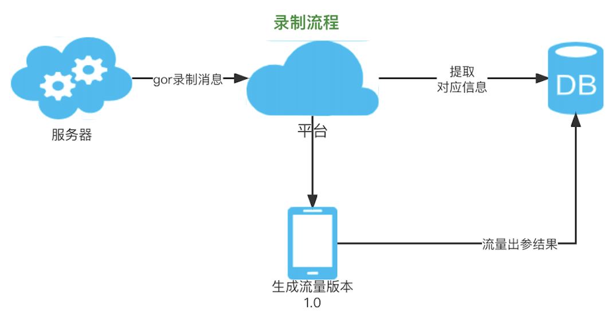
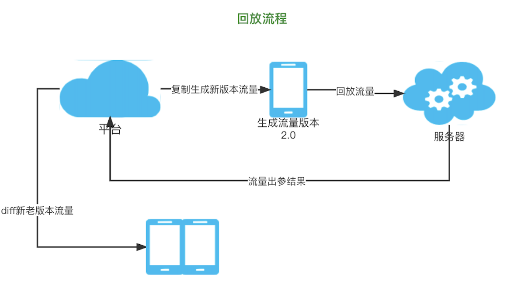
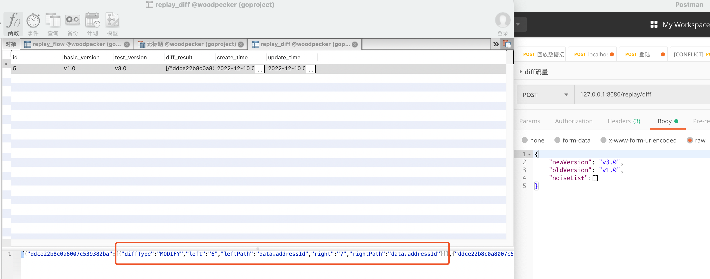
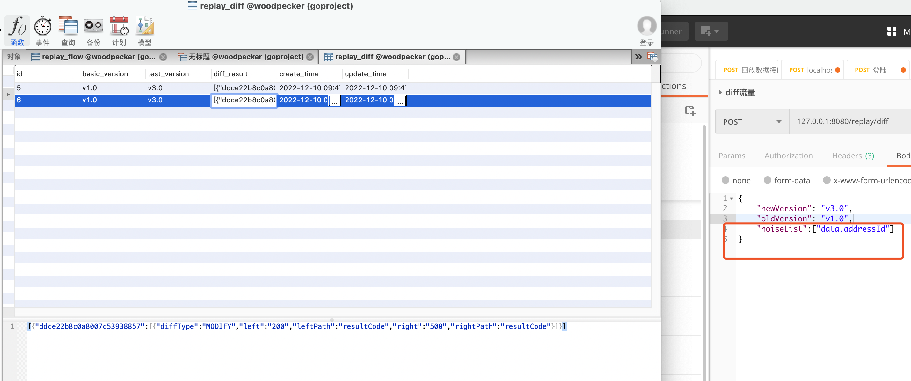

## 啄木鸟流量回放平台
### 项目简介
* 本项目是基于[RuoYi-Vue](https://gitee.com/y_project)单应用版本
* 流量回放引擎基于[goreplay](https://github.com/buger/goreplay)
* 演示系统基于[newbee-mall-api-go](https://github.com/newbee-ltd/newbee-mall-api-go)

如果你想从录制开始体验，需要搭建[演示系统newbee-mall-api-go](https://github.com/newbee-ltd/newbee-mall-api-go)
，同时需要将[gor](https://github.com/buger/goreplay) 部署在演示系统服务中，搭建kafka以便收集流量（你需要在项目中将KafkaConsumer 这个类的自动注入注释解除）
相关文档准备中....

如果你想直接体验平台流程，直接部署本 前后端分离项目即可，相关文档准备中....

### 流程介绍

#### 录制流量
首先创建一个基准版本的流量数据：

1. gor录制流量并发送kafka消息
2. 平台通过消费kafka提取对应的字段
3. 平台通过指定时间段对录制流量添加对应的版本号，用于后续diff不同版本的接口出参
4. 平台回放录制的流量，并将对应的接口出参结果保存起来（因为gor对出参没有办法100%录制，只能通过平台请求对应接口后再保存）

#### 回放流量
当系统版本迭代时，需要回归原有接口
1. 平台通过复制原版本流量，生成新的版本流量（这里复制的数据仅仅只有接口入参）
2. 平台回放新的版本流量，保存对应的出参结果
3. 平台通过唯一的gorid(录制时产生的)，进行diff操作（diff操作需要降噪）
4. 平台只存储diff存在异常的结果，相同的结果无需存储

#### diff结果
这里的前端页面还没有实现，diff 高亮显示 json指定的key（寻求大佬帮助 ）

没有降噪字段的传参

降噪字段传参

### 共创
目前项目只有一人在开发，进度比较缓慢（尤其是前端），寻求大佬共同迭代本项目，也期待您的意见

### 规划
- [ ] jvm-sandbox-repeater 接入
- [ ] mock服务

Q群号 1154555924

